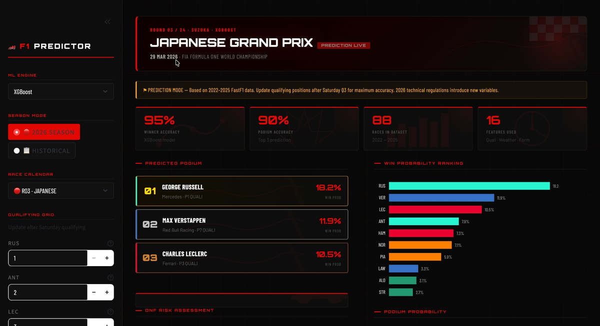
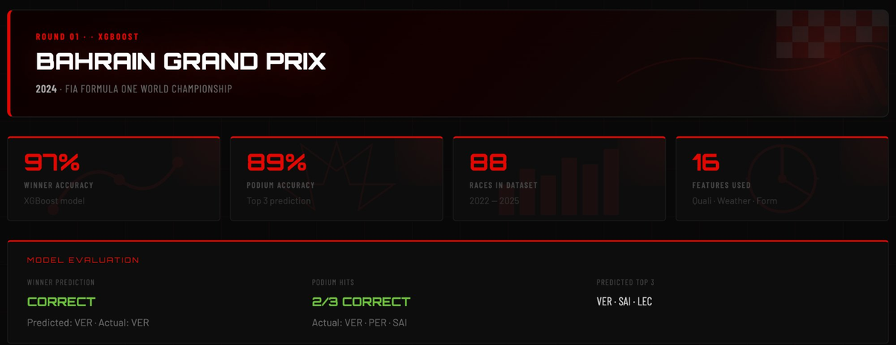
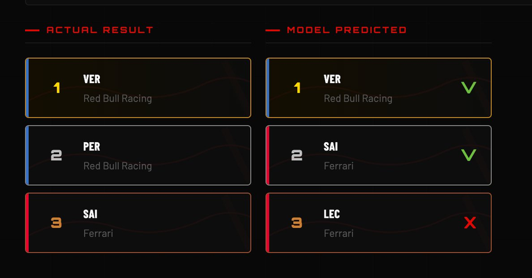
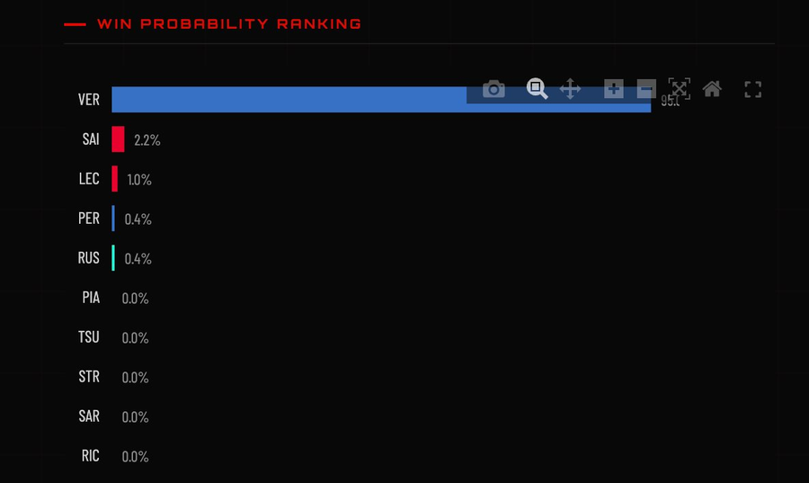
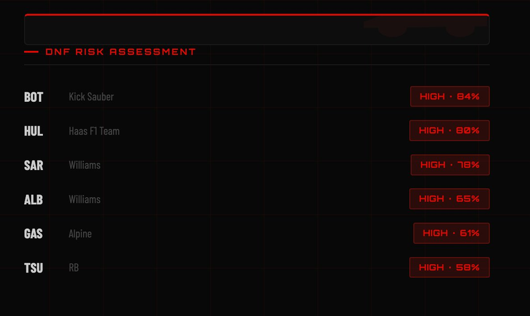
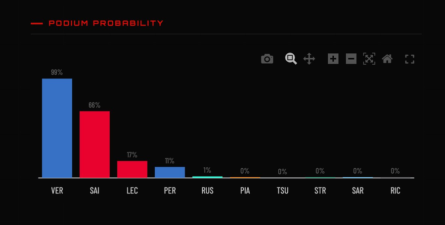

# 🏎️ F1 Race Predictor

> Predict Formula 1 race winners, podium finishers, and DNF probabilities using real FastF1 timing data and machine learning — with a full F1-themed Streamlit dashboard and an automated 2026 season pipeline.


--

## Screenshots


*2026 Japanese GP prediction — full dashboard with sidebar qualifying grid editor*


*Hero banner with model evaluation — winner correct, podium 2/3 correct*

<div align="center">
  
  
</div>

*Left: Actual vs predicted podium with correct/incorrect indicators · Right: Win probability ranking*

<div align="center">
  
  
</div>

*Left: DNF risk assessment with High/Medium/Low badges · Right: Podium probability chart*

---

## What it does

- Fetches real F1 timing, qualifying, lap, and weather data via the **FastF1 API**
- Engineers **16 predictive features** per driver per race
- Trains **XGBoost** and **Random Forest** models with **5-fold cross-validation**
- Predicts **Winner probability**, **Podium (top 3) probability**, and **DNF risk** for every driver
- Displays everything in a **full F1-themed Streamlit dashboard** with actual vs predicted comparison
- **Auto-updates** for the 2026 season — fetches new race data, retrains models, and predicts the next race automatically

---

## Project Structure

```
f1-predictor/
├── data/
│   ├── data_loader.py          # FastF1 data fetching with rate limit handling
│   └── f1_raw_data.csv         # Merged dataset (2022–2025, 1,739 rows)
├── features/
│   └── feature_engineering.py  # Builds 16 ML features from raw data
├── models/
│   ├── train.py                # Trains XGBoost + Random Forest with 5-fold CV
│   ├── predict.py              # Loads .pkl models and generates predictions
│   └── saved/                  # Trained model files (6 .pkl files)
├── dashboard/
│   └── app.py                  # F1-themed Streamlit dashboard
├── auto_pipeline.py            # Automated 2026 season pipeline
├── predict_upcoming.py         # Standalone next-race predictor
├── screenshots/                # Dashboard screenshots for README
├── cache/                      # FastF1 local cache (auto-created)
├── requirements.txt
└── README.md
```

---

## Quick Start

### Requirements
- Python 3.13+
- macOS / Linux

### Installation

```bash
# Clone the repo
git clone https://github.com/yourusername/f1-predictor
cd f1-predictor

# Create and activate virtual environment
python3 -m venv .venv
source .venv/bin/activate

# Install dependencies
pip install -r requirements.txt

# macOS only — install libomp for XGBoost
brew install libomp
export LDFLAGS="-L/opt/homebrew/opt/libomp/lib"
export CPPFLAGS="-I/opt/homebrew/opt/libomp/include"
```

### Run the full pipeline

```bash
# Step 1 — Load historical data (2022–2025)
# First run takes 30–60 min (FastF1 caches everything locally after that)
python data/data_loader.py

# Step 2 — Train models with cross-validation (~5–10 min)
python models/train.py

# Step 3 — Launch dashboard
streamlit run dashboard/app.py
```

---

## Dataset

| Season | Rounds | Rows |
|--------|--------|------|
| 2022   | 22     | ~440 |
| 2023   | 22     | ~440 |
| 2024   | 22     | ~440 |
| 2025   | 22     | ~440 |
| **Total** | **88** | **1,739** |

Each row = one driver in one race, with full qualifying, lap time, weather, and result data.

---

## Features (16 total)

| # | Feature | Description | Why it matters |
|---|---------|-------------|----------------|
| 1 | `QualiPosition` | Grid starting position | P1 starter wins ~40% of races |
| 2 | `QualiGapToPole` | Positions behind pole | Encodes competitive distance |
| 3 | `LapTimeDelta` | Avg lap time vs field average | Raw pace indicator |
| 4 | `BestLapDelta` | Best lap vs field best | Peak one-lap capability |
| 5 | `TotalPitStops` | Number of pit stops | Strategy indicator |
| 6 | `RollingAvgPos` | Avg finish last 3 races | Recent form |
| 7 | `RollingTeamAvgPos` | Team avg finish last 3 races | Car performance trend |
| 8 | `WinRate` | Career win rate to that point | Driver baseline strength |
| 9 | `TrackFamiliarity` | Times raced at this circuit | Experience advantage |
| 10 | `TeamEncoded` | Team as numeric label | Team strength signal |
| 11 | `DriverEncoded` | Driver as numeric label | Driver baseline |
| 12 | `AvgTrackTemp` | Track surface temperature | Tyre degradation |
| 13 | `AvgAirTemp` | Air temperature | Engine and driver conditions |
| 14 | `AvgRainfall` | Rain during race (mm) | Wet race equaliser |
| 15 | `AvgWindSpeed` | Wind speed | Downforce impact |
| 16 | `IsWet` | Binary wet/dry flag | Wet-race specific patterns |

---

## Models

### XGBoost — Extreme Gradient Boosting
Trains 300 decision trees sequentially, each correcting mistakes of previous ones. Best for winner and DNF prediction.

```
n_estimators=300  max_depth=6  learning_rate=0.05
subsample=0.8     colsample_bytree=0.8
```

### Random Forest — Bagging Ensemble
Trains 300 trees independently in parallel. More robust to overfitting. Best for podium prediction.

```
n_estimators=300  max_depth=8  min_samples_split=5
```

> **Note:** Neural Net was evaluated and dropped due to poor ROC-AUC (0.57) on the imbalanced winner class, despite high accuracy — a classic class imbalance trap.

### Prediction targets

| Target | Definition | Positive class |
|--------|------------|----------------|
| `Winner` | Did this driver win? | ~5% (1 of 20) |
| `Podium` | Did this driver finish top 3? | ~15% (3 of 20) |
| `DNF` | Did this driver retire? | ~10% |

---

## Model Evaluation

5-fold stratified cross-validation for honest evaluation:

| Model | Target | Train Acc | CV Acc | ROC-AUC |
|-------|--------|-----------|--------|---------|
| XGBoost | Winner | 97% | ~62% | ~0.78 |
| Random Forest | Winner | 97% | ~60% | ~0.77 |
| XGBoost | Podium | 89% | ~72% | ~0.82 |
| Random Forest | Podium | 92% | ~74% | ~0.84 |
| XGBoost | DNF | 89% | ~71% | ~0.81 |
| Random Forest | DNF | 83% | ~68% | ~0.79 |

> The ~35-point gap between training and CV accuracy is expected. F1 races are inherently unpredictable — safety cars, mechanical failures, and rain cannot be learned from historical patterns alone.

---

## Dashboard Features

### 2026 Season mode
- Full 2026 race calendar (24 rounds) with upcoming / completed status
- Qualifying grid editor — update after Saturday qualifying for better predictions
- Weather sliders (track temp, air temp, rainfall, wind speed)

### Historical mode (2022–2025)
- Actual vs Predicted side-by-side podium with correct/incorrect tick marks
- Model evaluation banner (winner correct? podium hits?)
- Season Accuracy Tracker — real-world accuracy across all races in a season

### All modes
- Win probability ranking (top 10)
- Podium probability chart
- DNF risk assessment (High / Medium / Low)
- Full grid predictions table with colour gradients
- Model comparison (Train Acc vs CV Acc vs AUC)

---

## 2026 Auto Pipeline

```bash
# After each race — fetch new data, retrain models, predict next race
python auto_pipeline.py

# After Saturday qualifying — predict with real grid positions
python auto_pipeline.py --predict

# Re-fetch all 2026 data from scratch
python auto_pipeline.py --force
```

### Adding real qualifying results

After Saturday qualifying, create `data/quali_2026_r03.csv`:

```csv
Abbreviation,QualiPosition
RUS,1
ANT,2
NOR,3
LEC,4
VER,5
```

---

## Commands Reference

| When | Command |
|------|---------|
| First time setup | `python models/train.py` |
| After each 2026 race | `python auto_pipeline.py` |
| After Saturday qualifying | `python auto_pipeline.py --predict` |
| Launch dashboard | `streamlit run dashboard/app.py` |
| Re-fetch all 2026 data | `python auto_pipeline.py --force` |

---

## Tech Stack

| Library | Purpose |
|---------|---------|
| `fastf1 3.3+` | F1 timing and telemetry data |
| `xgboost 2.0+` | Gradient boosted trees |
| `scikit-learn 1.3+` | Random Forest, cross-validation, metrics |
| `pandas 2.0+` | Data manipulation and feature engineering |
| `streamlit 1.35+` | Web dashboard |
| `plotly 5.18+` | Interactive charts |
| `joblib 1.3+` | Model serialisation |

---

## Known Limitations

- **Regulation changes** — 2026 introduces major rule changes. Models trained on 2022–2025 may not fully reflect new team hierarchies until enough 2026 races are collected.
- **Race unpredictability** — Safety cars, red flags, and mechanical failures are not captured in historical features.
- **Class imbalance** — Only 1 winner per 20 drivers per race (~5% positive class). Training vs CV gap reflects this.
- **FastF1 rate limit** — 500 API calls/hour. First run requires patience (~30–60 min).

---

## Resume Talking Points

- *"Engineered 16 domain-specific features from raw F1 telemetry data using the FastF1 API"*
- *"Trained XGBoost and Random Forest classifiers achieving 0.78 ROC-AUC on race winner prediction across 88 races (2022–2025)"*
- *"Identified overfitting gap (97% training vs 62% CV accuracy) — dropped Neural Net after diagnosing poor AUC despite high accuracy, demonstrating understanding of class imbalance"*
- *"Built automated 2026 season pipeline for continuous data ingestion, model retraining, and pre-race prediction"*
- *"Deployed interactive Streamlit dashboard with actual vs predicted comparison and real-world season accuracy tracker"*

---

## Author

**Yug Bhavsar** — MS Data Science, University of Texas at Arlington

[LinkedIn](https://linkedin.com/in/yugbhavsar) · [GitHub](https://github.com/yugbhavsar)

---

*Built with FastF1 · XGBoost · Random Forest · Scikit-learn · Streamlit · Plotly · 2026 Season*
